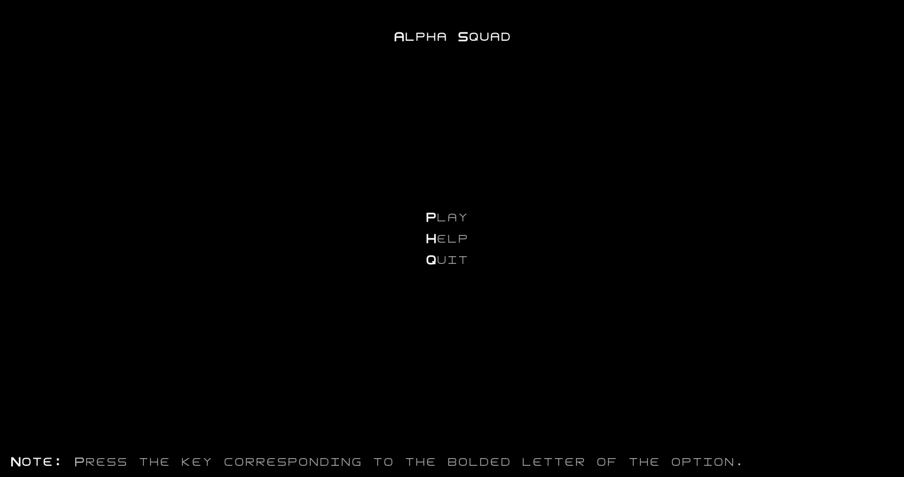
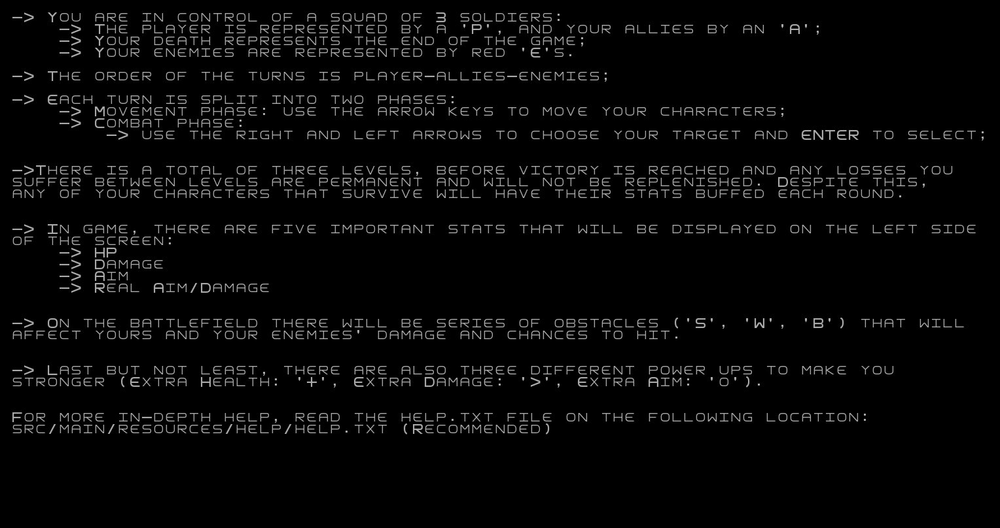
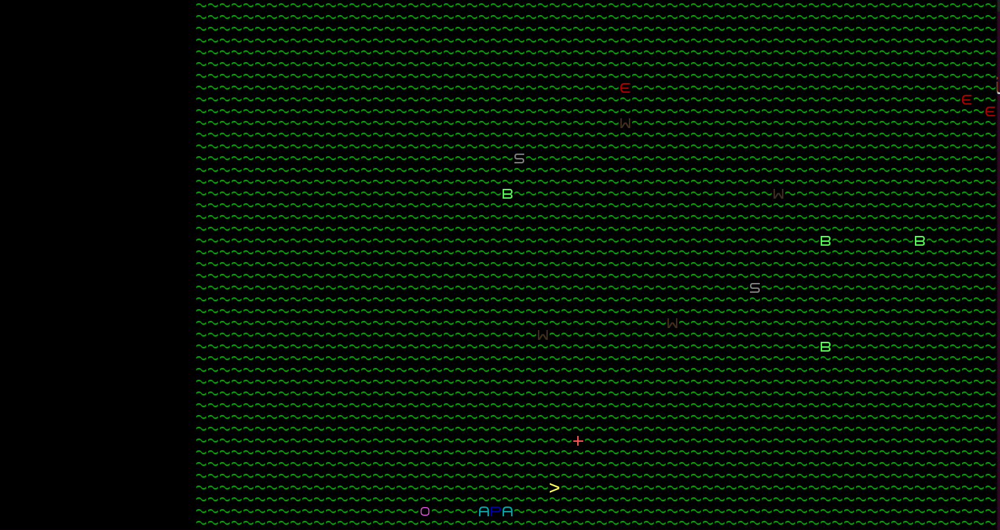
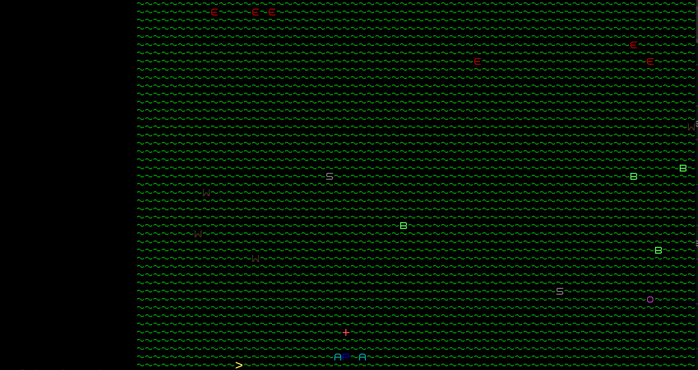
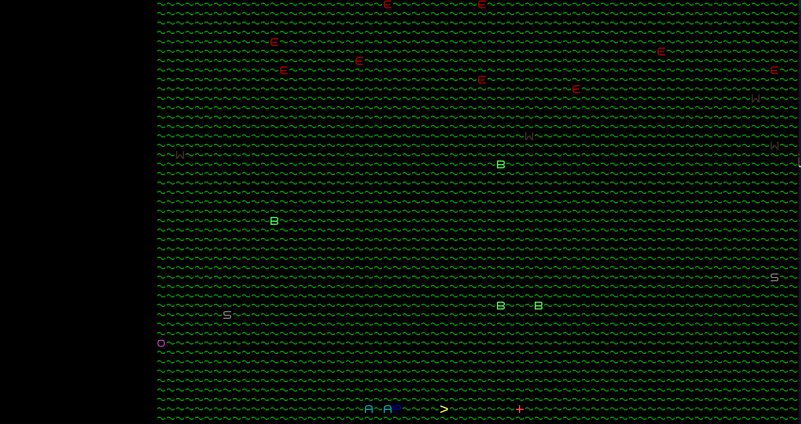
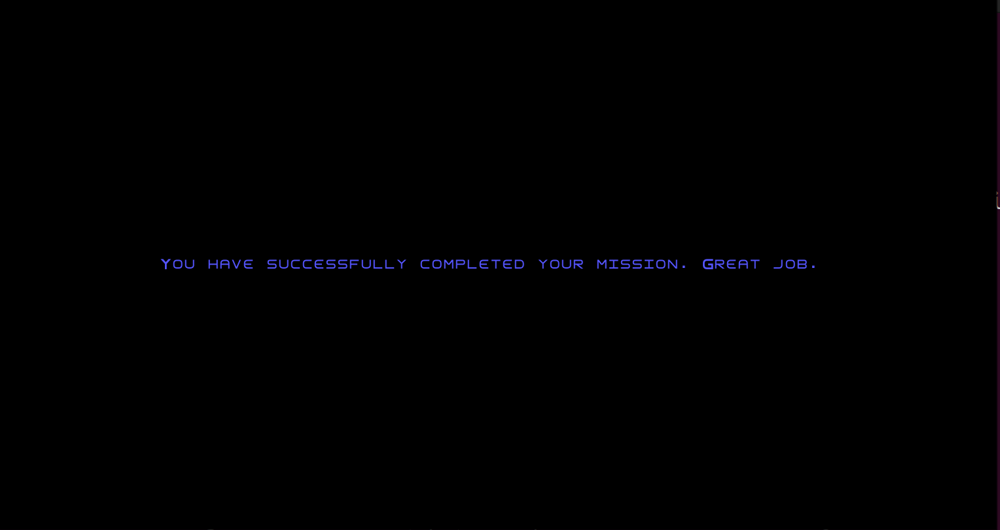
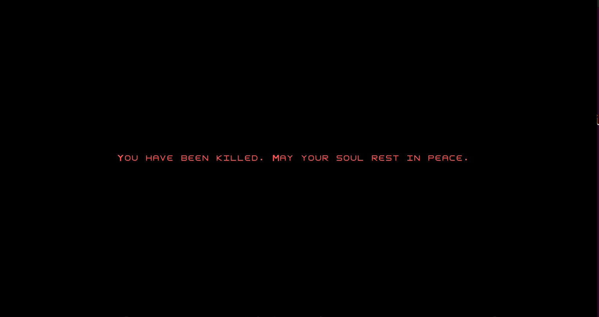
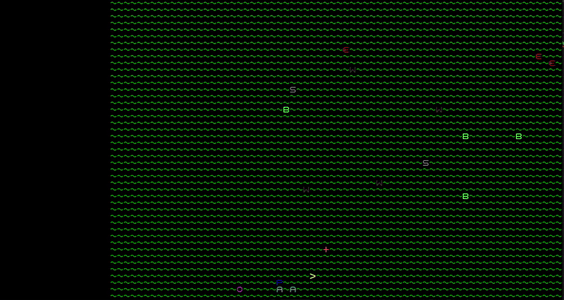
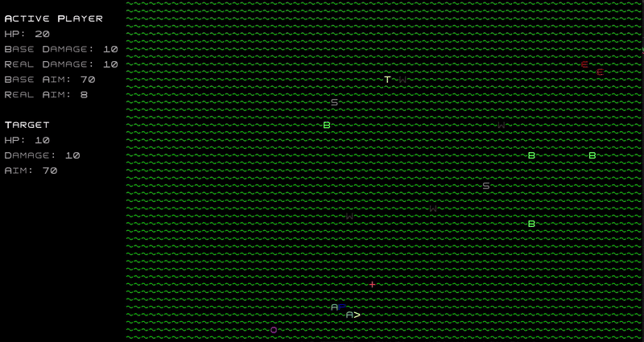

## LDTS_T01G06 - Alpha Squad

Neste projeto, propomos criar um jogo inspirado no [Armoured Commander](https://store.steampowered.com/app/1361580/Armoured_Commander/), com elementos adicionais retirados do sistema de combate do [XCOM Enemy Unknown](https://store.steampowered.com/app/200510/XCOM_Enemy_Unknown/). Por fim, também toma como inspiração [Dwarf Fortress](https://store.steampowered.com/app/975370/Dwarf_Fortress/) para os graficos.

O objetivo do jogo é proporcionar um confronto PvE entre dois esquadrões, em que o jogador poderá recolher *power-ups* para melhorar a sua performance e facilitar o combate. O jogo termina com a vitória do esquadrão ou com a morte do jogador, apresentando uma mensagem de *game over*.

O projeto foi desenvolvido por Casemiro Medeiros (up202301897@fe.up.pt), Guilherme Ferreira (up202207524@fe.up.pt) e Hugo Alves (up202305395@fe.up.pt) para LDTS 2024⁄25.

---
### *FEATURES* IMPLEMENTADAS

- **Menu Inicial** - O jogo tem um menu inicial com opções de:
  - `Play` - Inicia o combate no nível 1
  - `Help` - Apresenta um ecrã que explica como o jogo funciona e algumas dicas
  - `Quit` - Fecha o jogo

- **Power-ups** - Implementamos alguns *power-ups* iniciais, sendo eles:
  - `Health (+)` - Aumenta o HP em 20 pontos
  - `Aim (o)` - Melhora a precisão em 10 pontos
  - `Damage (>)` - Aumenta o dano em 5 pontos

- **Blocos de obstáculos** - Implementamos alguns tipos de obstáculos, os quais são:
  - `Arbusto (B)` - Reduz a precisão do inimigo em 10 pontos
  - `Parede de Madeira Pequena (W)` - Reduz o dano recebido em 5 pontos e a precisão inimiga em 20 pontos
  - `Parede de Pedra Pequena (S)` - Reduz o dano recebido em 10 pontos e a precisão inimiga em 30 pontos
  
  > E necessario estar adjacente a eles e o obstáculo precisa estar entre a origem e o alvo para surtir efeito. Flanquear é uma tática válida para negar os efeitos dos obstáculos.

- **Diferentes níveis** - Há mais inimigos em cada nível. Os aliados que se mantiverem vivos para o próximo nível, sofrem uma melhoria nos seus *stats*. Vale ressaltar também que cada nível é gerado aleatoriamente.
  - `Nvl 1` - 3 inimigos
  - `Nvl 2` - 6 inimigos
  - `Nvl 3` - 9 inimigos

- **Efeitos Sonoros** - Após o disparo, quer seja de um aliado ou do inimigo, é sempre emitido um efeito sonoro de acerto ou de erro.

- **Tela de Vitória/Derrota** - No fim do jogo é exibida uma mensagem de finalização, seja de vitória ou de derrota.

  

  <b><i>Fig. 1 - Menu Inicial</i></b>

  

  <b><i>Fig. 2 - Ecrã de Help</i></b>

  

  <b><i>Fig. 3 - Nível 1</i></b>

  

  <b><i>Fig. 4 - Nível 2</i></b>

  

  <b><i>Fig. 4 - Nível 3</i></b>

  

  <b><i>Fig. 5 - Ecrã de vitória</i></b>

  

  <b><i>Fig. 6 - Ecrã de derrota</i></b>

  

  <b><i>Fig. 7 - Simulação do combate</i></b>

  

  <b><i>Fig. 8 - Coletar power-up</i></b>

---
### *FEATURES* FUTURAS

Apesar de todas as *features* inicialmente planeadas terem sido implementadas, seria possivel expandir as funcionalidades deste jogo. Algumas sugestoes seriam:

- Modo PvP
  - Em vez de se ter um oponente controlado pela máquina, teríamos outro jogador localmente a traçar estratégias e a tomar decisões no confronto.

- Novos *power-ups*
  - Novos *power-ups* tornam o jogo mais dinâmico, uma vez que abre possibilidade para novas estratégias. Como exemplo destes novos *power-ups* temos:
    - Munição incendiária: adiciona o efeito *burn* em que o combatente atingido por essa munição sofre dano extra por um certo numero de turnos.
    - Munição explosiva: adiciona a possibilidade de um ataque crítico que resultaria em mais dano contra o combatente atingido.
    - Equipa de medicos: adiciona a capacidade de recuperar HP durante um determinado numero de turnos.

- Novas *features* no mapa
  - Atualizações no mapa dão mais variedade de estratégias e uma maior dinamica ao jogo. Como exemplo temos:
    - Blocos de água: os combatentes não conseguem atravessar estes blocos.
    - Blocos de lama: adicionam a possibilidade do movimento não ser bem-sucedido e o combatente nao se mover.
    - Minas terrestre: blocos que parecem normais, mas explodem ao serem atravessados por um combatente, causando dano significativo. Poder-se-ia usar um novo *power-up* para contornar estes novos obstáculos.

---
### DESIGN

Antes de mais, e importante ressaltar que o design deste jogo tirou bastante inspiraçao do exemplo do *"Hero"* fornecido.
O design baseia-se, principalmente, em dois padrões. Primeiramente, utiliza a arquitetura MVC (Model - View - Controller), tornando o projeto mais modular. Contudo, com o avanço do desenvolvimento, foi necessario adotar um outro padrão de desenvolvimento, o *State Pattern*.

> This section should be organized in different subsections, each describing a different design problem that you had to solve during the project. Each subsection should be organized in four different parts:

- **Problem in Context.** The description of the design context and the concrete problem that motivated the instantiation of the pattern. Someone else other than the original developer should be able to read and understand all the motivations for the decisions made. When refering to the implementation before the pattern was applied, don’t forget to [link to the relevant lines of code](https://help.github.com/en/articles/creating-a-permanent-link-to-a-code-snippet) in the appropriate version.
- **The Pattern.** Identify the design pattern to be applied, why it was selected and how it is a good fit considering the existing design context and the problem at hand.
- **Implementation.** Show how the pattern roles, operations and associations were mapped to the concrete design classes. Illustrate it with a UML class diagram, and refer to the corresponding source code with links to the relevant lines (these should be [relative links](https://help.github.com/en/articles/about-readmes#relative-links-and-image-paths-in-readme-files). When doing this, always point to the latest version of the code.
- **Consequences.** Benefits and liabilities of the design after the pattern instantiation, eventually comparing these consequences with those of alternative solutions.

---
#### MVC
**Problema**

Um jogo possui, por norma, uma estrutura relativamente complexa, desde a capacidade de representar a sua informaçao de maneira visivel de modo a permitir a interaçao do jogador ate as atualizaçoes da informaçao que advem de tal interaçao e envolve muitas partes, e, obviamente, a melhor opção é organizar o código da melhor maneira possível. 
Para tornar o código mais facilmente extendivel e adaptavel para novas funcionalidades, a estrutura precisa ser razoavelmente simples e modular, para permitir alteraçoes extensas sem que estas impliquem alterar partes do codigo com as quais tais alteraçoes tem pouca ou nenhuma relaçao.

**Pattern escolhido**

O padrão de arquitetura MVC é uma escolha perfeita para resolver o problema citado. De maneira geral, este padrão divide o projeto em três partes:
- **Model** - Trata da lógica do jogo e do armazenamento dos dados
- **View** - Apresenta os dados do `model` no ecrã
- **Controller** - Disponibiliza os dados do `model` para o `view`, interpreta as interaçoes com o utilizador e despoleta atualizaçoes do `model` com base nas tais interaçoes.

**Implementação**

No nosso caso, dividimos o código em três grandes partes:
- **Model** - Contém a lógica básica e os dados de todos os elementos do jogo (Player, Inimigos, Obstáculos, etc...);
- **View** - Representa os dados de cada do `model` de cada elemento (desenha o jogador, por exemplo)
- **Controller** - Controla a lógica do jogo. Decide o que deve ser feito através da interpretação de *inputs* (por exemplo, atualizar o `model`) e disponibiliza ao `view` os dados do `model`

  Este padrao foi amplamente aplicado, desde as estruturas mais gerais (por exemplo, GameModel, GameView, GameController) ate as mais especificas (por exemplo, PlayerControl, PlayerDraw, Player).

**Os *packages* citados podem ser encontrados através destes *links*:**
- [Model](../src/main/java/Game/model)
- [View](../src/main/java/Game/view)
- [Controller](../src/main/java/Game/controller)

**Consequencias**

O recurso ao MVC apresenta as seguintes vantagens e desvantagens:

- Os diversos metodos do codigo ficam compartimentalizados de acordo com as suas funcoes e objetivos, sendo separados de metodos e dados com os quais eles nao tem qualquer relaçao.
- A expansao ou refatorizaçao de alguma das partes acima referidas e independente das restantes permitindo que tais alteraçoes nao impliquem a refatorizaçao das outras partes desnecessariamente.
- No entanto, isto resulta num numero razoavelmente maior de classes e a necessidade de assegurar comunicaçao adequada entre todas as partes quando necessario, uma vez que elas cntinuam, de certa forma, "dependentes" umas das outras.

#### State

**Problema**

Uma vez que a funcionalidade do jogo nao se restringe apenas a  existencia de um unico "ecra" de jogo, mas esta sim espalhada por diversos "ecras" diferentes, cada um com funcionalidades distintas e independentes um dos outros, foi necessario arranjar forma de permitir transicoes entre eles de acordo com as necessidades do utilizador. 
Inicialmente, estas transiçoes eram geridas pelo *MainMenuScreen*, isto e, sempre que um ecra novo era lançado, esta classe era responsavel por lançar o ecra correto e, quando este retorna-se, o *MainMenuScreen* tomava o controlo novamente.
Isto tornava a inserçao de novos ecras complexa e implicava que, independentemente do que estivesse a ocorrer no ecra, haveria sempre uma instancia do *MainMenuScreen* desnecessaria no "fundo".

**Pattern escolhido**

Para resolver este problema e por recomendaçao do professor, recorremos ao **State pattern**. Este padrão permite-nos representar diversos estados com diferentes funcionalidades e ter ativo apenas o estado necessario naquele momento. Neste caso, cada estado representa um "ecra" diferente e implementa as funcionalidades necessarias para o correto funcionamento do respetivo ecra.
Cada estado e tambem responsavel pela manutencao dos seus respetivos MVCs e por assegurar a transicao entre estados quando necessario.
Este padrao ajudou-nos a resolver o problema anteriormente descrito, pois a criaçao de um novo "ecra" implica apenas a criaçao de um novo estado e pequenas alteraçoes que assegurem que esse estado possa ser acedido evitando alteraçoews em areas nao relacionadas.
Para alem disso, este padrao permitiu um isolamento melhor dos MVCs especificos de cada estado e evita a existencia de classes redundantes ativas no "fundo".

**Implementação**

A figura seguinte demonstra como as classes que implementam este padrao se relacionam com o MVC (a estrutura de classes abstratas foi utilizada para representar esta relaçao).

As classes que representam este padrao sao:

- [State](java/Game/state/State.java)
- [MainMenuState](java/Game/state/MainMenuState.java)
- [HelpState](java/Game/state/HelpState.java)
- [GameState](java/Game/state/GameState.java)
- [DefeatState](java/Game/state/DefeatState.java)
- [VictoryState](java/Game/state/VictoryState.java)

**Consequencias**

O recurso a este padrao resultou nas sesguintes vantagens e desvantagens:

- Permitiu isolar melhor os diferentes comportamentos e funcionalidades que o programa precisaria num dado momento.
- Trocas de estado sao relativamente faceis de se implementar.
- A adiçao de novos estados ´e relativamente simples.
- Isto resulta, similarmente ao MVC, num aumento do numero de classes, no entanto, nao e um aumento muito grande e o numero de classes nao parece ser dificil de gerir.

---
#### *CODE SMELLS* CONHECIDOS

##### *Buffer* de movimento do esquadrão aliado
Este pequeno *bug* acontece quando, antes do movimento do esquadrão aliado (seja do `P` (player), seja do `A` (aliado)), é pressionado alguma tecla de movimento. Após ser pressionada, ela é mantida em memória e, logo após o movimento ser liberado, a personagem move-se nesta direção.

##### Code smell 2
A classe [GameModel](java/Game/model/gameModel/GameModel.java) ´e visivelmente mais extensa do que qualquer outra. Poderia, possivelmente, ter alguns dos seus metodos movidos para uma outra classe.

##### Code smell 3
Quando ´e necessario mudar de estado, existe a necessidade de criar um model, viewer e controller adequados, poderia ser possivel simplificar para necessitar apenas do model.

##### Code smell 4
Chamadas a metodos da biblioteca *Lanterna* sao frequentes, no entanto, sempre que usadas, sao feitas chamadas diretas. Caso fosse necessario mudar a biblioteca, seria necessario fazer mudança em varias classes diferentes, especialmente, em *Controllers* e *Viewers*.

---
### TESTING

- [Testing Coverage Report](docs/tests/coverage/index.html)

- [Mutation Testing Report](docs/tests/pitest/index.html)

---
### AUTOAVALIAÇÃO

- Casemiro Medeiros:
- Guilherme Ferreira:
- Hugo Alves:
