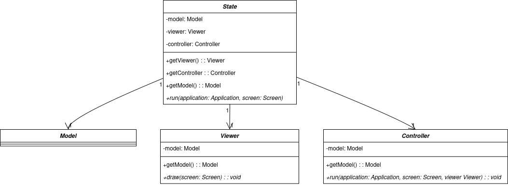
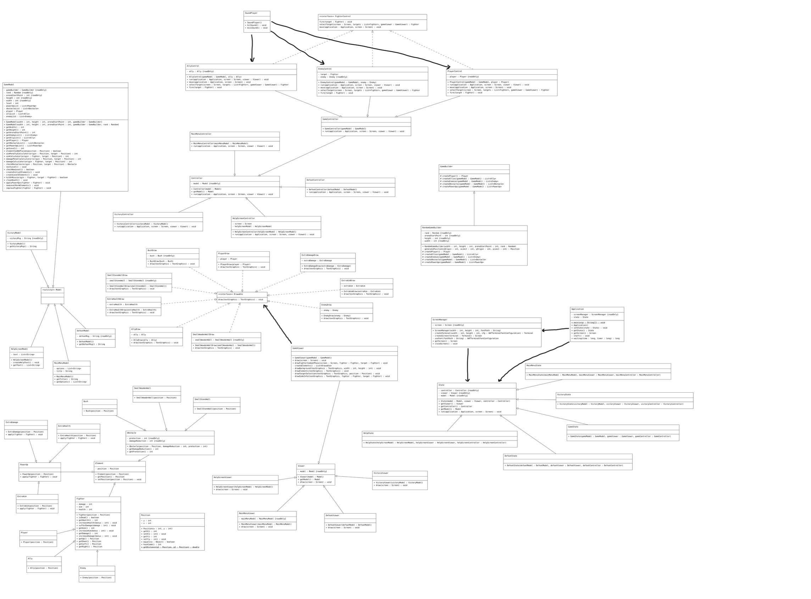

## LDTS_T01G06 - Alpha Squad

Neste projeto, propomos criar um jogo inspirado no [Armoured Commander](https://store.steampowered.com/app/1361580/Armoured_Commander/), com elementos adicionais retirados do sistema de combate do [XCOM Enemy Unknown](https://store.steampowered.com/app/200510/XCOM_Enemy_Unknown/). Por fim, também toma como inspiração [Dwarf Fortress](https://store.steampowered.com/app/975370/Dwarf_Fortress/) para os graficos.

O objetivo do jogo é proporcionar um confronto PvE entre dois esquadrões, em que o jogador poderá recolher *power-ups* para melhorar a sua performance e facilitar o combate. O jogo termina com a vitória do esquadrão ou com a morte do jogador, apresentando uma mensagem de *game over*.

O projeto foi desenvolvido por Casemiro Medeiros (up202301897@fe.up.pt), Guilherme Ferreira (up202207524@fe.up.pt) e Hugo Alves (up202305395@fe.up.pt) para LDTS 2024⁄25.

---
### *FEATURES* IMPLEMENTADAS

- **Menu Inicial** - O jogo tem um menu inicial com opções de:
  - `Play` - Inicia o combate no nível 1
  - `Help` - Apresenta um ecrã que explica como o jogo funciona e algumas dicas
  - `Quit` - Fecha o jogo

- **Power-ups** - Implementamos alguns *power-ups* iniciais, sendo eles:
  - `Health (+)` - Aumenta o HP em 20 pontos
  - `Aim (o)` - Melhora a precisão em 10 pontos
  - `Damage (>)` - Aumenta o dano em 5 pontos

- **Blocos de obstáculos** - Implementamos alguns tipos de obstáculos, os quais são:
  - `Arbusto (B)` - Reduz a precisão do inimigo em 10 pontos
  - `Parede de Madeira Pequena (W)` - Reduz o dano recebido em 5 pontos e a precisão inimiga em 20 pontos
  - `Parede de Pedra Pequena (S)` - Reduz o dano recebido em 10 pontos e a precisão inimiga em 30 pontos
  

  > É necessário estar adjacente a eles e o obstáculo precisa estar entre a origem e o alvo para surtir efeito. Flanquear é uma tática válida para negar os efeitos dos obstáculos.

- **Diferentes níveis** - Há mais inimigos em cada nível. Os aliados que se mantiverem vivos para o próximo nível, sofrem uma melhoria nos seus *stats*. Vale ressaltar também que cada nível é gerado aleatoriamente.
  - `Nvl 1` - 3 inimigos
  - `Nvl 2` - 6 inimigos
  - `Nvl 3` - 9 inimigos

- **Efeitos Sonoros** - Após o disparo, quer seja de um aliado ou do inimigo, é sempre emitido um efeito sonoro de acerto ou de erro.

- **Tela de Vitória/Derrota** - No fim do jogo é exibida uma mensagem de finalização, seja de vitória ou de derrota.

  

  <b><i>Fig. 1 - Menu Inicial</i></b>

  

  <b><i>Fig. 2 - Ecrã de Help</i></b>

  

  <b><i>Fig. 3 - Nível 1</i></b>

  

  <b><i>Fig. 4 - Nível 2</i></b>

  

  <b><i>Fig. 4 - Nível 3</i></b>

  

  <b><i>Fig. 5 - Ecrã de vitória</i></b>

  

  <b><i>Fig. 6 - Ecrã de derrota</i></b>

  

  <b><i>Fig. 7 - Simulação do combate</i></b>

  

  <b><i>Fig. 8 - Coletar power-up</i></b>

---
### *FEATURES* FUTURAS

Apesar de todas as *features* inicialmente planeadas terem sido implementadas, seria possível expandir as funcionalidades deste jogo. Algumas sugestoes seriam:

- Modo PvP
  - Em vez de se ter um oponente controlado pela máquina, teríamos outro jogador localmente a traçar estratégias e a tomar decisões no confronto.

- Novos *power-ups*
  - Novos *power-ups* tornam o jogo mais dinâmico, uma vez que abre possibilidade para novas estratégias. Como exemplo destes novos *power-ups* temos:
    - Munição incendiária: adiciona o efeito *burn* em que o combatente atingido por essa munição sofre dano extra por um certo número de turnos.
    - Munição explosiva: adiciona a possibilidade de um ataque crítico que resultaria em mais dano contra o combatente atingido.
    - Equipa de médicos: adiciona a capacidade de recuperar HP durante um determinado número de turnos.

- Novas *features* no mapa
  - Atualizações no mapa dão mais variedade de estratégias e uma maior dinâmica ao jogo. Como exemplo temos:
    - Blocos de água: os combatentes não conseguem atravessar estes blocos.
    - Blocos de lama: adicionam a possibilidade do movimento não ser bem-sucedido e o combatente nao se mover.
    - Minas terrestre: blocos que parecem normais, mas explodem ao serem atravessados por um combatente, causando dano significativo. Poder-se-ia usar um novo *power-up* para contornar estes novos obstáculos.

---
### DESIGN

Antes de mais, é importante ressaltar que o design deste jogo tirou bastante inspiração do exemplo do "Hero" fornecido.
O design baseia-se, principalmente, em dois padrões. Primeiramente, utiliza a arquitetura MVC (Model - View - Controller), tornando o projeto mais modular. Contudo, com o avanço do desenvolvimento, foi necessário adotar outro padrão de desenvolvimento, o State Pattern.

#### MVC
**Problema**

Um jogo possui, por norma, uma estrutura relativamente complexa, desde a capacidade de representar a sua informação de maneira visível, permitindo a interação do jogador, até às atualizações da informação que resultam dessa interação, envolvendo muitas partes. É, obviamente, essencial organizar o código da melhor maneira possível.
Para tornar o código mais facilmente extensível e adaptável a novas funcionalidades, a estrutura precisa de ser razoavelmente simples e modular, de forma a permitir alterações extensas sem que estas impliquem modificar partes do código com as quais tais alterações têm pouca ou nenhuma relação.

**Pattern escolhido**

O padrão de arquitetura MVC é uma escolha perfeita para resolver o problema citado. De maneira geral, este padrão divide o projeto em três partes:
- **Model** - Trata da lógica do jogo e do armazenamento dos dados
- **View** - Apresenta os dados do `model` no ecrã
- **Controller** - Disponibiliza os dados do `model` para o `view`, interpreta as interações com o utilizador e despoleta atualizaçoes do `model` com base nas tais interações.

**Implementação**

No nosso caso, dividimos o código em três grandes partes:
- **Model** - Contém a lógica básica e os dados de todos os elementos do jogo (Player, Inimigos, Obstáculos, etc...);
- **View** - Representa os dados de cada do `model` de cada elemento (desenha o jogador, por exemplo)
- **Controller** - Controla a lógica do jogo. Decide o que deve ser feito através da interpretação de *inputs* (por exemplo, atualizar o `model`) e disponibiliza ao `view` os dados do `model`

Este padrão foi amplamente aplicado, desde as estruturas mais gerais (por exemplo, GameModel, GameView, GameController) até às mais específicas (por exemplo, PlayerControl, PlayerDraw, Player).

**Os *packages* citados podem ser encontrados através destes *links*:**
- [Model](../src/main/java/Game/model)
- [View](../src/main/java/Game/view)
- [Controller](../src/main/java/Game/controller)

**Consequências**

O recurso ao MVC apresenta as seguintes vantagens e desvantagens:

Os diversos métodos do código ficam compartimentalizados de acordo com as suas funções e objetivos, sendo separados de métodos e dados com os quais não têm qualquer relação
A expansão ou refatorização de alguma das partes acima referidas é independente das restantes, permitindo que tais alterações não impliquem a refatorização das outras partes desnecessariamente
No entanto, isto resulta num número razoavelmente maior de classes e na necessidade de assegurar uma comunicação adequada entre todas as partes quando necessário, uma vez que elas continuam, de certa forma, "dependentes" umas das outras.

#### State

**Problema**

Uma vez que a funcionalidade do jogo não se restringe apenas à existência de um único "ecrã" de jogo, mas está, sim, espalhada por diversos "ecrãs" diferentes, cada um com funcionalidades distintas e independentes uns dos outros, foi necessário encontrar uma forma de permitir transições entre eles de acordo com as necessidades do utilizador.
Inicialmente, estas transições eram geridas pelo MainMenuScreen, isto é, sempre que um novo ecrã era lançado, esta classe era responsável por lançar o ecrã correto e, quando este retornasse, o MainMenuScreen retomava o controlo.
Isto tornava a inserção de novos ecrãs complexa e implicava que, independentemente do que estivesse a ocorrer no ecrã, haveria sempre uma instância do MainMenuScreen desnecessária em segundo plano.

**Pattern escolhido**

Para resolver este problema e por recomendação do professor, recorremos ao State pattern. Este padrão permite-nos representar diversos estados com diferentes funcionalidades e ter ativo apenas o estado necessário naquele momento. Neste caso, cada estado representa um "ecrã" diferente e implementa as funcionalidades necessárias para o correto funcionamento do respetivo ecrã.
Cada estado é também responsável pela manutenção dos seus respetivos MVCs e por assegurar a transição entre estados, quando necessário.
Este padrão ajudou-nos a resolver o problema anteriormente descrito, pois a criação de um novo "ecrã" implica apenas a criação de um novo estado e pequenas alterações para assegurar que esse estado possa ser acedido, evitando alterações em áreas não relacionadas.
Para além disso, este padrão permitiu um melhor isolamento dos MVCs específicos de cada estado e evita a existência de classes redundantes ativas em segundo plano.

**Implementação**

A figura seguinte demonstra como as classes que implementam este padrão se relacionam com o MVC (a estrutura de classes abstratas foi utilizada para representar esta relação).

  

  <b><i>Fig. 9 - UML State Pattern</i></b>

**As classes que representam este padrão são:**

- [State](../src/main/java/Game/state/State.java)
- [MainMenuState](../src/main/java/Game/state/MainMenuState.java)
- [HelpState](../src/main/java/Game/state/HelpState.java)
- [GameState](../src/main/java/Game/state/GameState.java)
- [DefeatState](../src/main/java/Game/state/DefeatState.java)
- [VictoryState](../src/main/java/Game/state/VictoryState.java)

**Consequências**

O recurso a este padrão resultou nas seguintes vantagens e desvantagens:

Permitiu isolar melhor os diferentes comportamentos e funcionalidades que o programa necessita num dado momento
- Trocas de estado são relativamente fáceis de implementar
- A adição de novos estados é relativamente simples
- Isto resulta, de forma semelhante ao MVC, num aumento do número de classes; no entanto, este aumento não é muito significativo e o número de classes não parece ser difícil de gerir

---
#### *CODE SMELLS* CONHECIDOS

##### *Buffer* de movimento do esquadrão aliado
Este pequeno bug ocorre quando, antes do movimento do esquadrão aliado (seja do P (jogador), seja do A (aliado)), é pressionada alguma tecla de movimento. Após ser pressionada, a tecla é mantida em memória e, assim que o movimento é permitido, a personagem desloca-se nessa direção.

##### Code smell 2
A classe [GameModel](../src/main/java/Game/model/gameModel/GameModel.java) é visivelmente mais extensa do que qualquer outra. Poderia, possivelmente, ter alguns dos seus métodos movidos para outra classe.
Tentou-se fazer essa separação, mas isso resultou na existência de uma classe que necessitava da existência de uma instância do GameModel, o que impedia a efetiva separação dessas funcionalidades, não tendo nenhum dos impactos positivos esperados.

##### Code smell 3
Quando é necessário mudar de estado, é preciso criar um `model`, um `viewer` e um `controller` adequados. Seria possível simplificar para que apenas o `model` fosse necessário.
Não temos a certeza do quão benéfico seria adotar esta abordagem em comparação a implementação atual.

##### Code smell 4
As chamadas a métodos da biblioteca Lanterna são frequentes; no entanto, sempre que utilizadas, são feitas de forma direta. Caso fosse necessário mudar a biblioteca, seria preciso realizar alterações em várias classes diferentes, em particular, nos *Controllers* e *Viewers*.
No entanto, como existem diversas chamadas diferentes, existiram dúvidas sobre como fazer essa separação adequadamente sem comprometer funcionalidades. 
Além disso, devido à dimensão naturalmente pequena do projeto e ao uso relativamente concentrado dessas chamadas num número pequeno de classes, muitas das quais são classes razoavelmente simples, achamos que esse esforço seria melhor dedicado noutros lados.

---
### Diagrama UML final

  

  <b><i>Fig. 10 - UML</i></b>

---
### TESTING

- <a href="https://feup-ldts-2024.github.io/project-t01g06/tests/coverage/index.html" target="_blank" title="Testing Coverage Report">Testing Coverage Report</a>

- <a href="https://feup-ldts-2024.github.io/project-t01g06/tests/pitest/index.html" target="_blank" title="Mutation Testing Report">Mutation Testing Report</a>

---
### AUTOAVALIAÇÃO

- Casemiro Medeiros: 30%
- Guilherme Ferreira: 20%
- Hugo Alves: 50%
